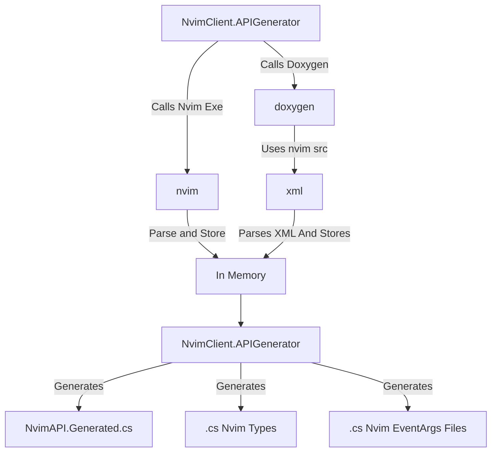

# NvimClient.APIGenerator

This project aims to generate C# code from discoverable API from an nvim
executable as well as documentation from a neovim source tree. This project
is a backbone of the `nvim.net` remote plugin host since it generates the api
for C# plugin developers.

By generating the C# code from the nvim discoverable API allows for fast
updating of the C# codebase from the latest neovim executables allows for
the project to be in sync with future neovim releases.

The source generation process is the following. The `NvimClient.APIGenerator`
executable spawns a `doxygen` process and an `nvim` process.

1. `doxygen` is pointed to the `nvim` source code in order to generate xml documentation.
2. `nvim` is spawned with the `--api-info` flag in order to generate MsgPack encoded
    api definitions.

Then the doxygen xml is converted into C# docuemntation xml tags. Similarly the api
definitions into C# an NvimAPI partial class along with supported definitions.



I will get back with additional information.

## Building

This project can be built by issuing:
```bash
dotnet build
```
From the repository root directory.

If you wish to only build only the `NvimClient.APIGenerator` executable you can
`cd` to the specific project directory and issue `dotnet build` there:

```bash
cd src/NvimClient.APIGenerator/
dotnet build
```

## Usage

1. Install the latest nvim executable for your operating system.
2. Clone the neovim source repository
```
git clone https://github.com/neovim/neovim.git
```

3. Checkout the version of source code that is equal to the latest nvim executable
this should be a tag in neovim source code. In this example we are using version
0.11.3
```
cd neovim
git checkout v0.11.3
```

4. Create a directory for the output files. For in this example the `API` directory is
used.
```bash
mkdir API
NvimClient.APIGenerator.exe API /path/to/nvim/source
```


The end result will be the following:
```
API
└── Generated
    ├── EventArgs
    │   ├── BellEventArgs.cs
    │   ├── BusyStartEventArgs.cs
    │   ├── BusyStopEventArgs.cs
    │   ├── ClearEventArgs.cs
    │   ├── CmdlineBlockAppendEventArgs.cs
    │   ├── CmdlineBlockHideEventArgs.cs
    │   ├── CmdlineBlockShowEventArgs.cs
    │   ├── CmdlineHideEventArgs.cs
    │   ├── CmdlinePosEventArgs.cs
    │   ├── CmdlineShowEventArgs.cs
    │   ├── CmdlineSpecialCharEventArgs.cs
    │   ├── CursorGotoEventArgs.cs
    │   ├── DefaultColorsSetEventArgs.cs
    │   ├── EolClearEventArgs.cs
    │   ├── FlushEventArgs.cs
    │   ├── HighlightSetEventArgs.cs
    │   ├── ModeChangeEventArgs.cs
    │   ├── ModeInfoSetEventArgs.cs
    │   ├── MouseOffEventArgs.cs
    │   ├── MouseOnEventArgs.cs
    │   ├── OptionSetEventArgs.cs
    │   ├── PopupmenuHideEventArgs.cs
    │   ├── PopupmenuSelectEventArgs.cs
    │   ├── PopupmenuShowEventArgs.cs
    │   ├── PutEventArgs.cs
    │   ├── ResizeEventArgs.cs
    │   ├── ScrollEventArgs.cs
    │   ├── SetIconEventArgs.cs
    │   ├── SetScrollRegionEventArgs.cs
    │   ├── SetTitleEventArgs.cs
    │   ├── SuspendEventArgs.cs
    │   ├── TablineUpdateEventArgs.cs
    │   ├── UpdateBgEventArgs.cs
    │   ├── UpdateFgEventArgs.cs
    │   ├── UpdateMenuEventArgs.cs
    │   ├── UpdateSpEventArgs.cs
    │   ├── VisualBellEventArgs.cs
    │   ├── WildmenuHideEventArgs.cs
    │   ├── WildmenuSelectEventArgs.cs
    │   └── WildmenuShowEventArgs.cs
    ├── NvimAPI.Generated.cs
    └── Types
        ├── NvimBuffer.cs
        ├── NvimTabpage.cs
        └── NvimWindow.cs

3 directories, 44 files
```

Those directories can then be moved to the `NvimClient.API` project. Or they
can be directly generated in the `NvimClient.API/Generated` directory.